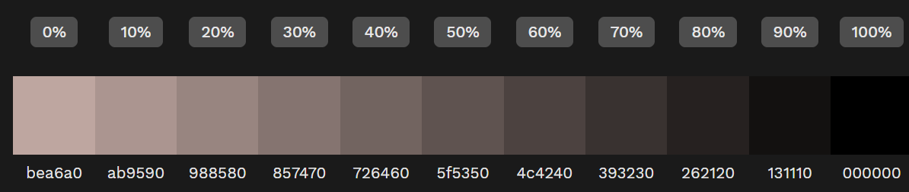
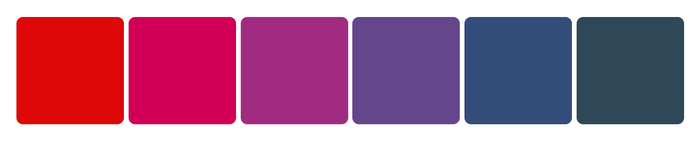

# Recall

So far, this is a rather scattered project.  I got the idea from [https://reactpractice.dev/articles/7-challenges-to-do-before-a-react-interview/](7 challenges to do before a React interview), *Build a memory game*.  It stated it's a good project to practice state management with, and I thought it would be good to practice:
- `useReducer`
- light/dark mode theme toggle
- dropdowns
- accessibility & animates
- database.

## Memory Game

For ease, I scaled the MVP back to just practicing **Klingon** vocabulary as I'm learning with **Duolingo**.  But I will add other sections to practice a variety of programming languages, like *JavaScript*, *Python*, *C#*, and either *PHP* or *Rust*:
- where you'll need to match methods
- or match comparable code snippets.

## MVP

Klingon vocabulary memory game.
- Firebase database with key-value pairs

### Developing Resources

